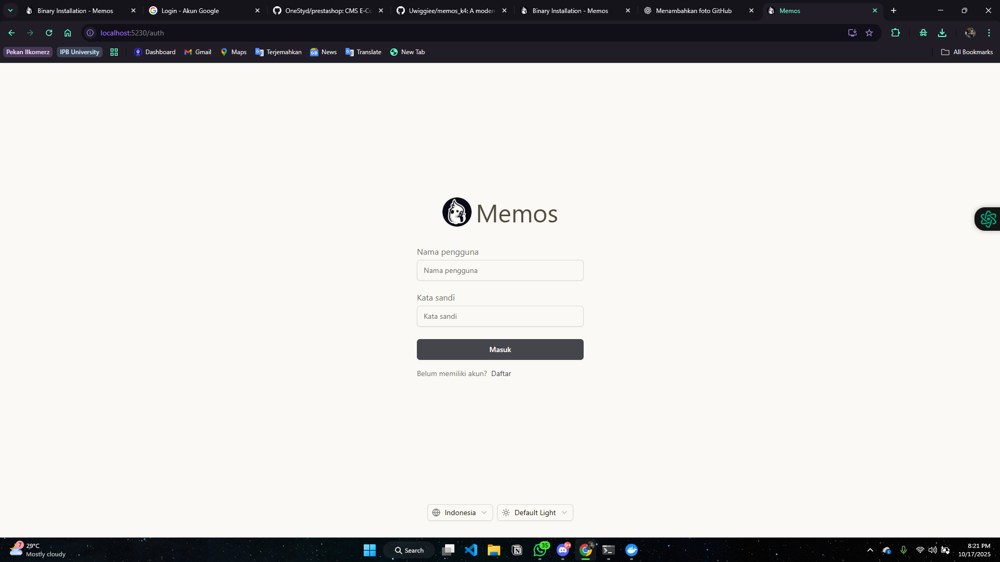
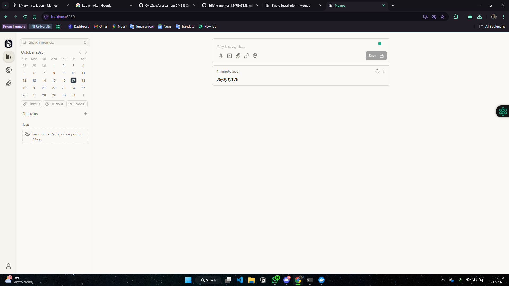
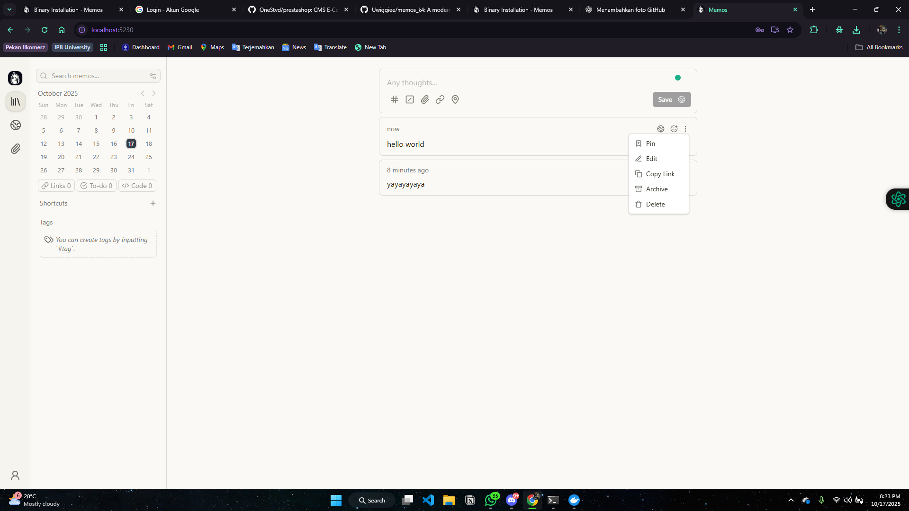
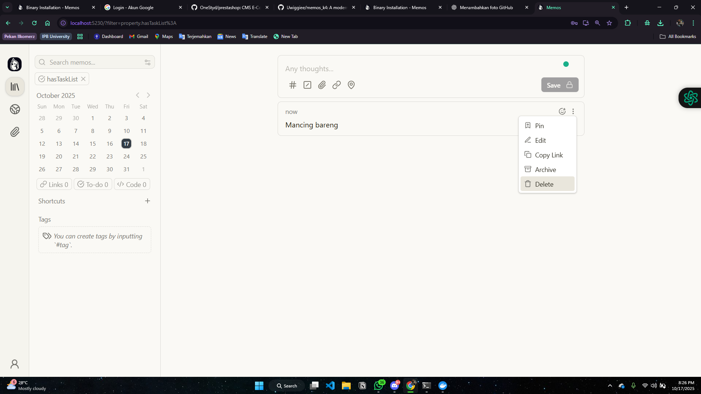
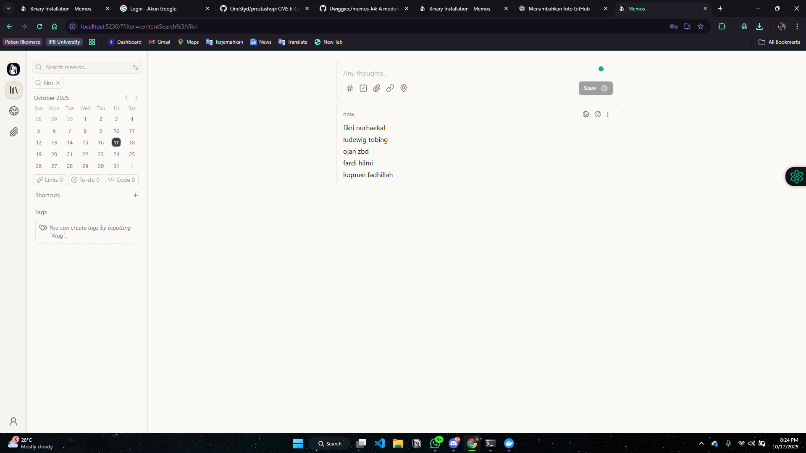

# Memos


Memos adalah sebuah layanan pencatat yang ringan, open-source, dan mengutamakan privasi (privacy-first). Aplikasi ini dirancang untuk menjadi tempat bagi Anda mencatat ide dan pemikiran secara cepat dan efisien. Konsepnya mirip seperti memiliki Twitter atau media sosial pribadi, di mana setiap catatan ("memo") ditampilkan dalam sebuah alur waktu (timeline).


# INSTALASI

## System Requirements
Minimum Requirements
- RAM: 512 MB
- Storage: 1 GB available space
- CPU: Any modern x86_64 or ARM64 processor

Supported Platforms
- Linux (x86_64, ARM64)
- macOS (Intel, Apple Silicon)
- Windows (x86_64)
- Docker (all platforms)

Database Support
- SQLite (default) - Perfect for single-user instances
- PostgreSQL - Recommended for multi-user production deployments
- MySQL/MariaDB - Alternative for existing MySQL infrastructure

Prasyarat

Pastikan perangkat lunak berikut sudah terinstal di VM:
1.  **Docker**: Platform untuk menjalankan aplikasi dalam kontainer.
2.  **Docker Compose**: Alat untuk mendefinisikan dan menjalankan aplikasi Docker.
3.  **Akses Terminal/CLI**: Akses ke antarmuka baris perintah di VM Anda.

# Langkah Instalasi
## install docker


Install Docker Engine on Ubuntu
To get started with Docker Engine on Ubuntu, make sure you
[meet the prerequisites](#prerequisites), and then follow the
[installation steps](#installation-methods).

## Prerequisites

### Firewall limitations

> [!WARNING]
>
> Before you install Docker, make sure you consider the following
> security implications and firewall incompatibilities.

- If you use ufw or firewalld to manage firewall settings, be aware that
  when you expose container ports using Docker, these ports bypass your
  firewall rules. For more information, refer to
  [Docker and ufw](/manuals/engine/network/packet-filtering-firewalls.md#docker-and-ufw).
- Docker is only compatible with `iptables-nft` and `iptables-legacy`.
  Firewall rules created with `nft` are not supported on a system with Docker installed.
  Make sure that any firewall rulesets you use are created with `iptables` or `ip6tables`,
  and that you add them to the `DOCKER-USER` chain,
  see [Packet filtering and firewalls](/manuals/engine/network/packet-filtering-firewalls.md).

### OS requirements

To install Docker Engine, you need the 64-bit version of one of these Ubuntu
versions:

- Ubuntu Questing 25.10
- Ubuntu Plucky 25.04
- Ubuntu Noble 24.04 (LTS)
- Ubuntu Jammy 22.04 (LTS)

Docker Engine for Ubuntu is compatible with x86_64 (or amd64), armhf, arm64,
s390x, and ppc64le (ppc64el) architectures.

> [!NOTE]
>
> Installation on Ubuntu derivative distributions, such as Linux Mint, is not officially
> supported (though it may work).

### Uninstall old versions

Before you can install Docker Engine, you need to uninstall any conflicting packages.

Your Linux distribution may provide unofficial Docker packages, which may conflict
with the official packages provided by Docker. You must uninstall these packages
before you install the official version of Docker Engine.

The unofficial packages to uninstall are:

- `docker.io`
- `docker-compose`
- `docker-compose-v2`
- `docker-doc`
- `podman-docker`

Moreover, Docker Engine depends on `containerd` and `runc`. Docker Engine
bundles these dependencies as one bundle: `containerd.io`. If you have
installed the `containerd` or `runc` previously, uninstall them to avoid
conflicts with the versions bundled with Docker Engine.

Run the following command to uninstall all conflicting packages:

```console
$ for pkg in docker.io docker-doc docker-compose docker-compose-v2 podman-docker containerd runc; do sudo apt-get remove $pkg; done
```

`apt-get` might report that you have none of these packages installed.

Images, containers, volumes, and networks stored in `/var/lib/docker/` aren't
automatically removed when you uninstall Docker. If you want to start with a
clean installation, and prefer to clean up any existing data, read the
[uninstall Docker Engine](#uninstall-docker-engine) section.

## Installation methods

You can install Docker Engine in different ways, depending on your needs:

- Docker Engine comes bundled with
  [Docker Desktop for Linux](/manuals/desktop/setup/install/linux/_index.md). This is
  the easiest and quickest way to get started.

- Set up and install Docker Engine from
  [Docker's `apt` repository](#install-using-the-repository).

- [Install it manually](#install-from-a-package) and manage upgrades manually.

- Use a [convenience script](#install-using-the-convenience-script). Only
  recommended for testing and development environments.

{}

### Install using the `apt` repository {#install-using-the-repository}

Before you install Docker Engine for the first time on a new host machine, you
need to set up the Docker `apt` repository. Afterward, you can install and update
Docker from the repository.

1. Set up Docker's `apt` repository.

   ```bash
   # Add Docker's official GPG key:
   sudo apt-get update
   sudo apt-get install ca-certificates curl
   sudo install -m 0755 -d /etc/apt/keyrings
   sudo curl -fsSL {}/gpg -o /etc/apt/keyrings/docker.asc
   sudo chmod a+r /etc/apt/keyrings/docker.asc

   # Add the repository to Apt sources:
   echo \
     "deb [arch=$(dpkg --print-architecture) signed-by=/etc/apt/keyrings/docker.asc] {} \
     $(. /etc/os-release && echo "${UBUNTU_CODENAME:-$VERSION_CODENAME}") stable" | \
     sudo tee /etc/apt/sources.list.d/docker.list > /dev/null
   sudo apt-get update
   ```

2. Install the Docker packages.

   
   

   To install the latest version, run:

   ```console
   $ sudo apt-get install docker-ce docker-ce-cli containerd.io docker-buildx-plugin docker-compose-plugin
   ```

   
   

   To install a specific version of Docker Engine, start by listing the
   available versions in the repository:

   ```console
   # List the available versions:
   $ apt-cache madison docker-ce | awk '{ print $3 }'

   5:{}-1~ubuntu.24.04~noble
   5:{}-1~ubuntu.24.04~noble
   ...
   ```

   Select the desired version and install:

   ```console
   $ VERSION_STRING=5:{}-1~ubuntu.24.04~noble
   $ sudo apt-get install docker-ce=$VERSION_STRING docker-ce-cli=$VERSION_STRING containerd.io docker-buildx-plugin docker-compose-plugin
   ```

   
   

    > [!NOTE]
    >
    > The Docker service starts automatically after installation. To verify that
    > Docker is running, use:
    > 
    > ```console
    > $ sudo systemctl status docker
    > ```
    >
    > Some systems may have this behavior disabled and will require a manual start:
    >
    > ```console
    > $ sudo systemctl start docker
    > ```

3. Verify that the installation is successful by running the `hello-world` image:

   ```console
   $ sudo docker run hello-world
   ```

   This command downloads a test image and runs it in a container. When the
   container runs, it prints a confirmation message and exits.

You have now successfully installed and started Docker Engine.

{}

#### Upgrade Docker Engine

To upgrade Docker Engine, follow step 2 of the
[installation instructions](#install-using-the-repository),
choosing the new version you want to install.

### Install from a package

If you can't use Docker's `apt` repository to install Docker Engine, you can
download the `deb` file for your release and install it manually. You need to
download a new file each time you want to upgrade Docker Engine.

<!-- markdownlint-disable-next-line -->
1. Go to [`{}/dists/`]({}/dists/).

2. Select your Ubuntu version in the list.

3. Go to `pool/stable/` and select the applicable architecture (`amd64`,
   `armhf`, `arm64`, or `s390x`).

4. Download the following `deb` files for the Docker Engine, CLI, containerd,
   and Docker Compose packages:

   - `containerd.io_<version>_<arch>.deb`
   - `docker-ce_<version>_<arch>.deb`
   - `docker-ce-cli_<version>_<arch>.deb`
   - `docker-buildx-plugin_<version>_<arch>.deb`
   - `docker-compose-plugin_<version>_<arch>.deb`

5. Install the `.deb` packages. Update the paths in the following example to
   where you downloaded the Docker packages.

   ```console
   $ sudo dpkg -i ./containerd.io_<version>_<arch>.deb \
     ./docker-ce_<version>_<arch>.deb \
     ./docker-ce-cli_<version>_<arch>.deb \
     ./docker-buildx-plugin_<version>_<arch>.deb \
     ./docker-compose-plugin_<version>_<arch>.deb
   ```

    > [!NOTE]
    >
    > The Docker service starts automatically after installation. To verify that
    > Docker is running, use:
    > 
    > ```console
    > $ sudo systemctl status docker
    > ```
    >
    > Some systems may have this behavior disabled and will require a manual start:
    >
    > ```console
    > $ sudo systemctl start docker
    > ```

6. Verify that the installation is successful by running the `hello-world` image:

   ```console
   $ sudo docker run hello-world
   ```

   This command downloads a test image and runs it in a container. When the
   container runs, it prints a confirmation message and exits.

You have now successfully installed and started Docker Engine.

{}

#### Upgrade Docker Engine

To upgrade Docker Engine, download the newer package files and repeat the
[installation procedure](#install-from-a-package), pointing to the new files.

{}

## Uninstall Docker Engine

1. Uninstall the Docker Engine, CLI, containerd, and Docker Compose packages:

   ```console
   $ sudo apt-get purge docker-ce docker-ce-cli containerd.io docker-buildx-plugin docker-compose-plugin docker-ce-rootless-extras
   ```

2. Images, containers, volumes, or custom configuration files on your host
   aren't automatically removed. To delete all images, containers, and volumes:

   ```console
   $ sudo rm -rf /var/lib/docker
   $ sudo rm -rf /var/lib/containerd
   ```

3. Remove source list and keyrings

   ```console
   $ sudo rm /etc/apt/sources.list.d/docker.list
   $ sudo rm /etc/apt/keyrings/docker.asc
   ```

You have to delete any edited configuration files manually.

## Next steps

- Continue to [Post-installation steps for Linux](linux-postinstall.md).


## Instalasi memos

1.  **Buat Direktori Proyek**
    Buat folder untuk menyimpan file konfigurasi Memos, lalu masuk ke direktori tersebut.
    ```bash
    mkdir memos-app
    cd memos-app
    ```

2.  **Buat File `docker-compose.yml`**
    Buat file konfigurasi menggunakan editor teks seperti `nano`.
    ```bash
    nano docker-compose.yml
    ```
    Salin dan tempel konten berikut ke dalam file:
    ```yaml
    version: "3.0"
    services:
      memos:
        image: neosmemo/memos:latest
        container_name: memos
        volumes:
          - ~/.memos/:/var/opt/memos
        ports:
          - "5230:5230"
        restart: unless-stopped
    ```
    > **Penting:** Bagian `volumes` memetakan direktori `~/.memos/` di VM Anda ke dalam kontainer. Ini memastikan data Anda (database, gambar, dll.) tetap aman meskipun kontainer dihapus.

3.  **Jalankan Aplikasi**
    Simpan file, lalu jalankan Memos di latar belakang (`-d`).
    ```bash
    docker-compose up -d
    ```

4.  **Akses Aplikasi**
    Buka browser dan akses Memos melalui `(http://localhost:5230)`. Anda akan diminta untuk membuat akun admin saat pertama kali masuk.


# Cara Pemakaian
1. Login

Pada halaman ini menampilkan tampilan login untuk pengguna agar dapat mengakses fitur-fitur secara penuh, pengguna melakukan autentikasi dengan memasukkan username dan password yang telah ditentukan.

2. Halaman Depan

Tampilan utama pada aplikasi memberikan akses ke pengguna untuk mencoba fitur-fitur utama.

3. Membuat Catatan 

Di sini dapat bisa menuliskan catatan apapun dan catatan yang di save akan langsung muncul di bagian atas.

4. Mengelola Memo yang sudah ada

Memo dapat di edit, dihapus, dan di pin untuk mengontrol memo yang sudah ada.

5. Mencari memo

Ada fitur untuk mencari memo, misalkan memo sudah banyak menumpuk, di sebelah kanan ada fitur pencarian

## Tampilan Aplikasi & Fungsi Utama
Antarmuka Memos sangat minimalis, berfokus pada kotak input dan timeline.
- Membuat Memo: Ketik di kotak input. Gunakan sintaks Markdown untuk format.
- Menggunakan Tags: Tambahkan tag seperti #proyek atau #ide untuk mengkategorikan.
- Membuat Checklist: Gunakan sintaks - [ ] untuk item tugas yang belum selesai dan - [x] untuk yang sudah.
- Mengatur Visibilitas: Setiap memo bisa diatur sebagai Public, Protected, atau Private.


# Pembahasan
## Kelebihan 👍

- Kontrol Penuh Atas Data: Privasi terjamin karena self-hosted.
- Cepat dan Ringan: Antarmuka responsif dan tidak membebani server.
- Sederhana dan Fokus: Minimalis, bebas dari distraksi fitur yang tidak perlu.
- Fleksibel berkat API: Membuka peluang untuk integrasi dan otomatisasi.
- Instalasi Sangat Mudah: Dengan Docker, proses instalasi menjadi sangat cepat dan tidak rumit.

## Kekurangan 👎
- Memerlukan Pengetahuan Teknis: Proses instalasi dan maintenance menjadi penghalang bagi pengguna non-teknis.
- Tidak Ada Aplikasi Mobile Native: Akses di ponsel harus melalui browser (PWA), yang pengalamannya tidak sebaik aplikasi native.
- Fitur Kolaborasi Terbatas: Lebih dirancang untuk penggunaan personal daripada kerja tim.


# Perbandingan dengan Apple Notes
Jika dibandingkan dengan aplikasi sejenis yang populer seperti Apple Notes (Notes di iPhone), Memos menunjukkan perbedaan filosofi yang mendasar.
Perbedaan paling fundamental terletak pada platform dan kepemilikan data. Memos adalah aplikasi self-hosted yang berjalan di server pribadi Anda, memberikan kontrol penuh dan privasi 100% atas data. Sebaliknya, Apple Notes terintegrasi erat dengan ekosistem Apple dan menyimpan data pengguna di server iCloud. Dari segi biaya, perangkat lunak Memos gratis namun memerlukan biaya untuk server, sementara Apple Notes gratis sebagai bagian dari pembelian perangkat Apple.

Dari segi pengalaman penggunaan dan organisasi, keduanya juga berbeda. Memos menggunakan sistem tag (#tag) yang fleksibel dan penulisan berbasis Markdown, yang sangat efisien untuk pencatatan cepat dan teknis. Sementara itu, Apple Notes mengandalkan sistem folder yang lebih tradisional seperti file manager dan editor Rich Text (WYSIWYG), yang terasa lebih familiar bagi pengguna umum.

Untuk fitur tambahan, Apple Notes unggul dalam hal kreativitas dan integrasi ekosistem, dengan kemampuan untuk menggambar, memindai dokumen, dan kolaborasi yang solid dengan pengguna Apple lainnya. Keunggulan unik Memos justru terletak pada API-nya, yang membuka pintu bagi otomatisasi dan integrasi dengan alur kerja lain, sesuatu yang tidak dimiliki Apple Notes.

Kesimpulan Perbandingan
Memos adalah pilihan ideal bagi pengguna teknis yang memprioritaskan kepemilikan data, privasi, dan kesederhanaan. Ini adalah alat yang sempurna untuk power user yang ingin membuat "bank ide" pribadi yang bisa diakses dari mana saja.
Apple Notes lebih cocok untuk pengguna umum dalam ekosistem Apple yang membutuhkan aplikasi pencatat yang serbaguna, mudah digunakan, dan terintegrasi penuh dengan perangkat mereka.


